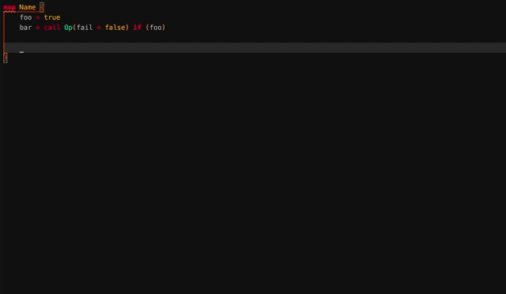

# Superface Language client for VSCode

Extension that provides a client for the Superface Language server and syntax highlighting definitions.

## Table of Contents

- [Install](#install)
- [Usage](#usage)
- [Development](#development)
- [Maintainers](#maintainers)
- [Contributing](#contributing)
- [License](#license)

## Install

Download the `.vsix` file from one of the Github [releases](https://github.com/superfaceai/language-client-vscode/releases).

Install the extension using

```shell
code --install-extension <path-to-vsix>
```

## Usage

The extension provides following features:
* Syntax highlighting for Comlink maps and profiles
* Code snippets for Comlink maps and profiles
* JSON schemas for Comlink ASTs and super.json (wip)
* Bundled [language server](https://github.com/superfaceai/language-server)
	- Syntax checking
	- Semantic linting
	- Workspace symbol search (requires VSCode to be open in workspace mode)



## Development

When developing, start with cloning the repository using `git clone https://github.com/superfaceai/language-client-vscode.git` (or `git clone git@github.com:superfaceai/language-client-vscode.git` if you have repository access).

After cloning, the dependencies must be downloaded using `yarn install` or `npm install`.

Now the repository is ready for code changes.

To test your changes there is a launch task prepared in the `.vscode` folder. Open the Run tab in your vscode and select the task "Launch Client". Then click the "Start Debugging" button or F5 and a new vscode window should open up with the WIP extension active.

The `package.json` also contains scripts (runnable by calling `yarn <script-name>` or `npm run <script-name>`):
- `lint` - lint the code (use `lint:fix` to run autofix)
- `format` - check the code formatting (use `format:fix` to autoformat)
- `build` - run the typescript compiler
- `prepush` - run `test`, `lint` and `format` checks. This should run without errors before you push anything to git.
- `package` - package the built output into a vsix extension

To install the extension from a local build, execute the `build` script, then the `package` script and then [install](#install) the generated vsix artifact.

## Maintainers

- [@Edward](https://github.com/TheEdward162)

## Contributing

**Please open an issue first if you want to make larger changes**

Feel free to contribute! Please follow the [Contribution Guide](CONTRIBUTION_GUIDE.md).

Licenses of node_modules are checked during CI/CD for every commit. Only the following licenses are allowed:

- 0BDS
- MIT
- Apache-2.0
- ISC
- BSD-3-Clause
- BSD-2-Clause
- CC-BY-4.0
- CC-BY-3.0;BSD
- CC0-1.0
- Unlicense

Note: If editing the README, please conform to the [standard-readme](https://github.com/RichardLitt/standard-readme) specification.

## License

The Superface is licensed under the [MIT](LICENSE).
© 2021 Superface
